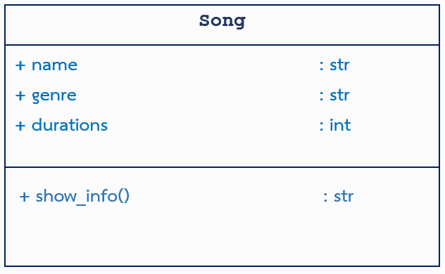

เนื่องจากพี่ฟิวส์เป็นพี่ TA ที่โหดร้ายกับน้อง ๆ และโจทย์ข้อต่อไปที่ยาก ๆ พี่ฟิวส์ก็เป็นคนออก พี่กานต์จึงได้ออกโจทย์ง่าย ๆ มาเพื่อให้น้อง ๆ ได้มีกำลังใจในการทำข้อต่อไปซะก่อน ซึ่งพี่อยากให้เรา สร้าง Class Song ที่จะเก็บข้อมูลประเภทของเพลง ชื่อเพลง และระยะเวลาของเพลงนั้นๆ (หน่วยเป็นวินาที)


จากนั้นให้สร้าง methods ```show_info()``` ที่จะคืนค่าข้อความในรูปแบบ String ตามรูปแบบด้านล่าง ( 1 คะแนน )
``` {ชื่อเพลง} <|> {ประเภทของเพลง} <|> {ระยะเวลาของเพลงในรูปแบบ นาที.วินาที} ```

หลังจากสร้างทุกอย่างเรียบร้อยแล้ว ให้นำโค้ดด้านล่างนี้ไปวาง แล้วนำขึ้นมาตรวจได้เลยย! >w<
``` python
Rickroll = Song(input(), input(), int(input()))
print(Rickroll.show_info())
```

------------------
Input Specification:
3 บรรทัด ชื่อเพลง ประเภทของเพลง และระยะเวลาของเพลงนั้นๆ (ระยะเวลาหน่วยเป็นนาที) ตามลำดับ

Output Specification:
1บรรทัด ผลลัพธ์จากการ print methods ```show_info()```

-------------------
Sample Testcase1:

input
``` 
Magnetic
KPOP
199
```
output
```
Magnetic <|> KPOP <|> 3.19
```
---------------

Sample Testcase2:

input
``` 
SHEESH
KPOP
183
```
output
```
SHEESH <|> KPOP <|> 3.03
```