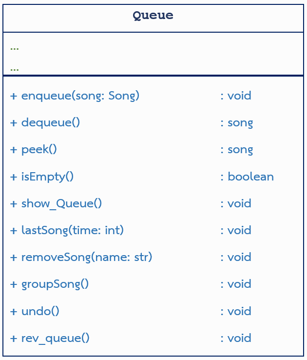

โจทย์ปัญหา
พี่ฟิวส์กำลังเขียนโปรแกรม Spotijub เป็นโปรแกรมศูนย์รวมเพลงจากหลากหลายศิลปิน ตอนนี้กำลังเขียนโปรแกรมในส่วนของการเรียงคิวเพลง ซึ่งพี่ฟิวส์จำเป็นต้องใช้หลักการ "Queue" เป็น Linear Data Structure ที่ดีเหมาะสมในการพัฒนาในโปรแกรมนี้ พี่อยากให้น้อง ๆ ช่วยเขียนคลาส Queue ขึ้นมา ซึ่งภายในคลาสนี้จะมีข้อมูลของเพลงแต่ละเพลง เรียงต่อ ๆ กันในลักษณะของ Queue ซึ่งข้อมูลแต่ละตัวจะถูกสร้างมาจากคลาส Song ของข้อที่แล้ว (Music class) โดยในคลาส Queue จะมี methods ที่จะใช้ในการให้คะแนนทั้งหมดดังนี้ ( คะแนนรวม 14 คะแนน ) ในส่วนของ Attribute ให้ลองวิเคราะห์และออกแบบเอง ว่าควรใช้โครงสร้างข้อมูลใด

สัดส่วนคะแนน แบ่งออกเป็น 3 กลุ่มดังนี้

- กลุ่ม Methods พื้นฐาน ได้แก่ enqueue, dequeue, peek, isEmpty และ show_Queue มีทั้งหมด 8 Testcase 4 คะแนน
- กลุ่ม Methods ที่ใช้ความรู้มาประยุกต์ในขั้นพื้นฐาน ได้แก่ lastSong, removeSong, groupSong 8 Testcase 4 คะแนน
- กลุ่ม Methods ที่ใช้ความรู้มาประยุกต์ในระดับที่ซับซ้อน ได้แก่ rev_queue และ undo 12 testcase 6 คะแนน


``` python
class Queue:
    def __init__(self):
        pass
    def enqueue(self, item: "Song"):
        pass
    def dequeue(self):
        pass
    def peek(self):
        pass
    def isEmpty(self):
        pass
    def show_Queue(self):
        pass
    def lastSong(self):
        pass
    def removeSong(self):
        pass
    def groupSong(self):
        pass
    def undo(self):
        pass
    def rev_queue(self):
        pass
```
- ``` enqueue(item) ``` ที่ใช้ในการเพิ่มข้อมูลเข้าไปใน คิว (Queue) โดยข้อมูลใหม่จะถูกเพิ่มที่ส่วนท้ายของคิวเสมอ โดยที่ item จะเป็นข้อมูลที่ถูกสร้างมาจาก Class Song จากข้อที่แล้ว

- ``` dequeue() ``` เพื่อเอาข้อมูลที่อยู่ หน้าสุด (Front) ของคิวออก และคืนค่าข้อมูลนั้น หากคิวว่างอยู่ให้เกิดแสดงข้อความว่า "Underflow! Dequeue from an empty queue"

- ``` peek() ``` เพื่อคืนค่าข้อมูลที่อยู่ หน้าสุด (Front) ของคิว โดยไม่ลบข้อมูลนั้นออกจากคิว หากคิวว่างแสดงว่า "Underflow! peek from an empty queue"

- ``` isEmpty() ``` เพื่อเช็คว่าคิวว่างหรือไม่ หากคิวว่างให้คืนค่า True และถ้ามีข้อมูลในคิวให้คืนค่า False

- ``` show_Queue() ``` ใช้เพื่อแสดงข้อมูลเพลงในคิว โดยที่จะมีการแสดงผลลำดับของข้อมูลนั้นในคิวเพิ่มเติม คือ Queue#{ลำดับของข้อมูลนั้น เริ่มต้นที่ลำดับที่ 1} ตามด้วยผลลัพธ์จาก methods show_info() ถ้า Queue ว่าง ให้แสดงผลว่า "Queue is empty!"

- ``` lastSong(time) ``` สมมุติว่าผู้ใช้ป้อน input เข้ามาเป็นเวลาที่มีในการฟังเพลง (หน่วยเป็นวินาที) และผู้ใช้ฟังเพลงในคิว วนไปเรื่อย ๆ (ฟังวน หมายถึง ถ้าฟังจบเพลงสุดท้ายในคิวแล้วก็จะวนกลับมาเพลงแรก) จงหาว่าเพลงสุดท้ายที่ผู้ใช้ได้ฟังคือเพลงอะไร ให้ตอบในรูปแบบเหมือน methods show_Queue() แต่แสดงผลแค่เพลงเดียว คือ เพลงสุดท้ายที่ได้ฟัง ถ้าใน Queue ว่าง ไม่มีเพลงอยู่เลย ให้แสดงผลว่า "Nothing here! Please add some song"

- ``` removeSong(name) ``` ลบเพลงที่ต้องการออกจาก Queue โดยจะรับ parameter มาเป็นชื่อเพลง ถ้าไม่สามารถลบได้ ให้แสดงผลว่า "Can not Delete! {name} is not exist"

- ``` groupSong() ``` ทำการแสดงผลชื่อเพลงใน Queue แบบแยกตามประเภทของเพลง ถ้าประเภทไหนมีมากกว่า 1 เพลง ให้แสดงผลตามเพลงที่พบก่อน คั่นด้วย " | " โดยให้แสดงเพลงประเภท JPOP, KPOP และ R&B ตามลำดับ

    ```python
    JPOP: ...
    KPOP: ...
    R&B: ...
    ```
- ``` undo() ``` เป็น methods ที่จะไปย้อนคืนการทำงานของ methods ล่าสุด ที่มีผลกับการเปลี่ยนแปลงข้อมูลใน Queue ไม่ว่าจะเป็นการเพิ่มข้อมูล ลบข้อมูล หรือ เปลี่ยนลำดับข้อมูล ส่วน methods ที่ไม่มีผลกับการเปลี่ยนแปลงข้อมูล จะไม่มีผลกับ methods นี้ ( เพื่อให้ไม่ยากเกินไป ) คล้าย ๆ กับการกด ctrl + z เวลาใช้โปรแกรม ถ้ามีการเรียกใช้ undo() ไปเรื่อย ๆ ก็หมายถึง จะย้อนคืนการทำงานไปเรื่อย ๆ
    ```
    ex1: มีการเรียกใช้ enqueue เพื่อเพิ่มเพลงเข้าไปในส่วนท้ายคิว หลังจากนั้นมีการใช้ undo ก็จะทำการ ลบเพลงนั้นออกจากท้ายคิว
    ex2: มีการเรียกใช้ dequeue เพื่อลบเพลงนั้นออกจากหัวคิว หลังจากนั้นมีการใช้ undo ก็จะทำการ เพิ่มเพลงนั้นกลับเข้าไปที่ส่วนหัวคิว
    ตัวอย่างอื่น ๆ สามารถลองวิเคราะห์ได้เอง
    ```
- ```rev_queue()``` ทำการย้อนลำดับข้อมูลใน Queue

หลังจากทำเสร็จแล้วให้นำโค้ด main() ไปวางต่อท้ายละนำขึ้นมาตรวจ โดยที่คะแนนที่จะได้รับ จะเป็นไป
ตามสัดส่วน Testcase ที่ถูก หมายความว่า ไม่ต้องถูกทุก Testcase ก็ยังได้คะแนน

นอกจากนี้ ขอห้ามไม่ให้มีการปรับเปลี่ยนโค้ดในฟังก์ชัน main() ใด ๆ ทั้งสิ้น หากพบ จะมีการหักคะแนนในภายหลัง
``` python
def main():
    """this is main function"""
    q = Queue()
    while (choice := input()) != "End":
        command, data = choice.split(": ")
        match command:
            case "enqueue":
                q.enqueue(Song(*data.split("|")))
            case "dequeue":
                temp = q.dequeue()
                if temp:
                    temp.show_info()
            case "peek":
                temp= q.peek()
                if temp:
                    temp.show_info()
            case "isEmpty":
                print(q.isEmpty())
            case "showQueue":
                q.show_Queue()
            case "lastSong":
                q.lastSong(int(data))
            case "removeSong":
                q.removeSong(data)
            case "groupSong":
                q.groupSong()
            case "undo":
                q.undo()
            case "rev":
                q.rev_queue()
    q.show_Queue()
main()
```
และด้วยความที่พี่ฟิวส์แก่แล้ว จึงไม่ค่อยถนัดใช้ Data Structure ที่มีอยู่แล้วใน python พี่เค้าเลยอยากให้น้อง ๆ ใช้ ความรู้ที่มีในการเขียน Data Structure ขึ้นมาเอง และ เลือกใช้ให้เหมาะสม โดยในข้อนี้จะมี Restrict word ดังนี้

Restricted word: [ ] .get import list( set enumerate append tuple reverse

    Input Specification
    มีได้หลายบรรทัด สามารถคาดเดาได้จากโค้ด main() ที่มีมาให้ในโจทย์

    Output Specification
    เป็นไปตาม methods แต่ละตัวที่เรียกใช้ แต่ผลลัพธ์ท้ายสุดจะมาจาก methods show_Queue()

Sample Testcase:
-

1:
```
enqueue: NIGHT DANCER|JPOP|206
enqueue: Overdose|JPOP|247
dequeue: _
enqueue: Tell Me It's Over (feat. Summer Walker & 6LACK)|R&B|356
enqueue: Boyfriend|R&B|45
dequeue: _
End
```
```
Dequeue item: NIGHT DANCER <|> JPOP <|> 3.26
Dequeue item: Overdose <|> JPOP <|> 4.07
Queue#1 Tell Me It's Over (feat. Summer Walker & 6LACK) <|> R&B <|> 5.56
Queue#2 Boyfriend <|> R&B <|> 0.45
```

2:
```
isEmpty: _
enqueue: Magnetic|KPOP|214
isEmpty: _
dequeue: _
dequeue: _
dequeue: _
enqueue: Magnetic|KPOP|214
enqueue: Overdose|JPOP|247
isEmpty: _
End
```
```
True
False
Dequeue item: Magnetic <|> KPOP <|> 3.34
Underflow! Dequeue from an empty queue
Underflow! Dequeue from an empty queue
False
Queue#1 Magnetic <|> KPOP <|> 3.34
Queue#2 Overdose <|> JPOP <|> 4.07
```

3:
```
enqueue: Magnetic|KPOP|214
enqueue: Overdose|JPOP|247
enqueue: Kokoronashi|JPOP|256
lastSong: 400
End
```
```
Queue#2 Overdose <|> JPOP <|> 4.07
Queue#1 Magnetic <|> KPOP <|> 3.34
Queue#2 Overdose <|> JPOP <|> 4.07
Queue#3 Kokoronashi <|> JPOP <|> 4.16
```

4:
```
enqueue: Saturn|R&B|195
enqueue: NIGHT DANCER|JPOP|206
enqueue: Magnetic|KPOP|214
removeSong: NIGHT DANCER
removeSong: Saturn
removeSong: Magnetic
removeSong: NIGHT DANCER
End
```
```
Can not Delete! NIGHT DANCER is not exist
Queue is empty!
```

5:
```
enqueue: Saturn|R&B|195
enqueue: NIGHT DANCER|JPOP|206
enqueue: Magnetic|KPOP|214
enqueue: Overdose|JPOP|247
enqueue: Kokoronashi|JPOP|256
enqueue: Boyfriend|R&B|45
enqueue: Tell Me It's Over (feat. Summer Walker & 6LACK)|R&B|356
enqueue: APT.|KPOP|333
enqueue: STUPID IN LOVE (feat. HUH YUNJIN of LE SSERAFIM)|KPOP|222
groupSong: _
End
```
```
JPOP: NIGHT DANCER | Overdose | Kokoronashi
KPOP: Magnetic | APT. | STUPID IN LOVE (feat. HUH YUNJIN of LE SSERAFIM)
R&B: Saturn | Boyfriend | Tell Me It's Over (feat. Summer Walker & 6LACK)
Queue#1 Saturn <|> R&B <|> 3.15
Queue#2 NIGHT DANCER <|> JPOP <|> 3.26
Queue#3 Magnetic <|> KPOP <|> 3.34
Queue#4 Overdose <|> JPOP <|> 4.07
Queue#5 Kokoronashi <|> JPOP <|> 4.16
Queue#6 Boyfriend <|> R&B <|> 0.45
Queue#7 Tell Me It's Over (feat. Summer Walker & 6LACK) <|> R&B <|> 5.56
Queue#8 APT. <|> KPOP <|> 5.33
Queue#9 STUPID IN LOVE (feat. HUH YUNJIN of LE SSERAFIM) <|> KPOP <|> 3.42
```

6:
```
enqueue: APT.|KPOP|333
enqueue: Overdose|JPOP|380
enqueue: Snooze|R&B|196
rev: _
showQueue: _
dequeue: _
undo: _
enqueue: Boyfriend|R&B|45
undo: _
End
```
```
Queue#1 Snooze <|> R&B <|> 3.16
Queue#2 Overdose <|> JPOP <|> 6.20
Queue#3 APT. <|> KPOP <|> 5.33
Dequeue item: Snooze <|> R&B <|> 3.16
Queue#1 Snooze <|> R&B <|> 3.16
Queue#2 Overdose <|> JPOP <|> 6.20
Queue#3 APT. <|> KPOP <|> 5.33
```